# Wave 4: Using an External Web API

## Goal

When clients use the task list API, they can create, read, update, delete, and sort tasks. Clients can also mark them as complete or incomplete.

When our users mark a task as complete, it's a big celebration! Our users want to be notified that a task was complete _with Slack messages_, using the Slack web API.

Our goal is to integrate the Slack web API. When our API marks a task as "complete," it should also make a call to the Slack API. The Slack API will post a message to a workspace and channel of our choosing.

## Requirements

To complete this wave, follow these steps:

1. Setup a Slack workspace
1. Create a Slackbot with the right permissions, and get a Slackbot API key
1. Verify that your Slackbot works using the Slack Tester
1. Verify that your Slackbot works using Postman
1. Modify the `/tasks/<task_id>/mark_complete` route to make a call to the Slack API
1. Use Postman to verify your work

### Setup a Slack Workspace

For this Task List API project, you will need an independent Slack workspace to use.

Create an independent Slack workspace. Follow classroom instructions to find out if these independent Slack workspaces are individual, in pairs, groups, classes, etc.

In your independent Slack workspace, create a public channel named `task-notifications`.

### Create a Slackbot

Ensure that you are able to log into Slack's API/Apps dashboard:

- Visit https://api.slack.com/apps, which is the dashboard for all Slack API things
  - This may redirect you to Slack. If so, sign in and then visit https://api.slack.com/apps again.

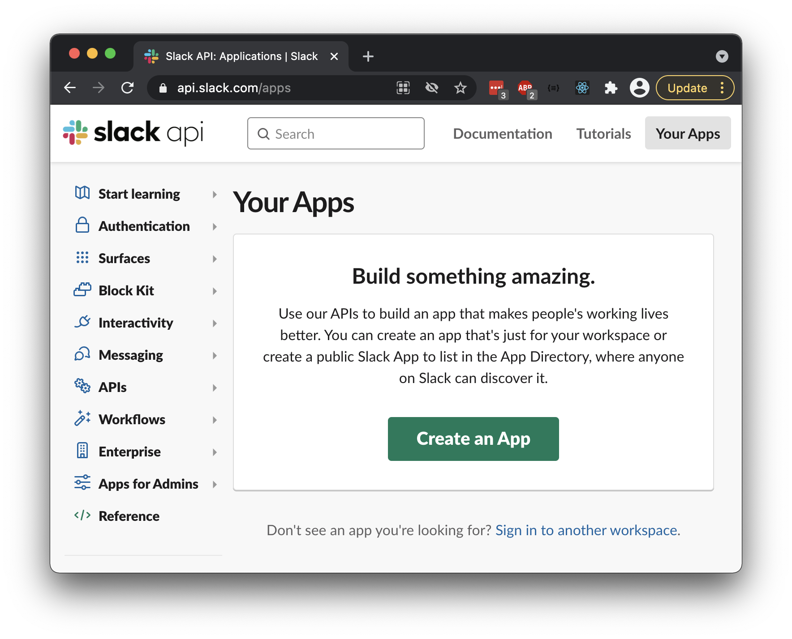

1. Go to "Your Apps"
   - Sign into the workspace that you want the Slackbot to live in
   - You can always go back to the "Your apps" page using the button on the top right
1. Make a new app by pressing the "Create an App" button
   - The app name doesn't matter, but we recommend including your first name or an identifier in it, such as "Ada's Bot."

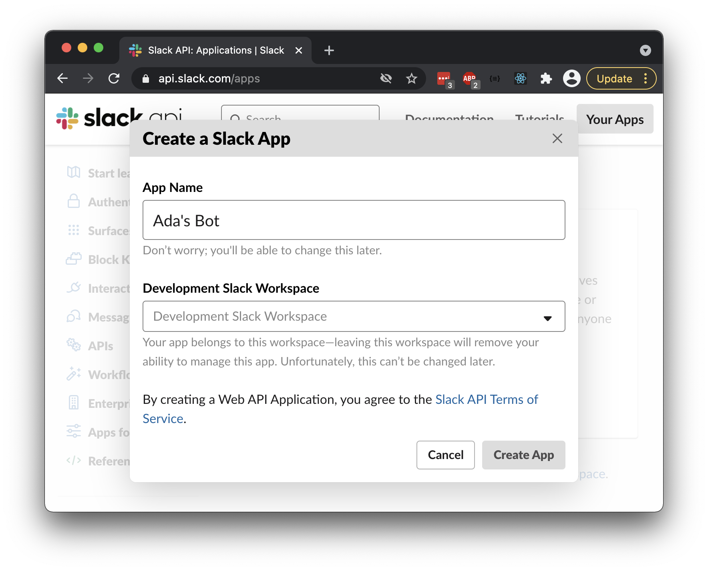

Making an app should bring you to a new page that lists "Add features and functionality" as a header. Expand this header.

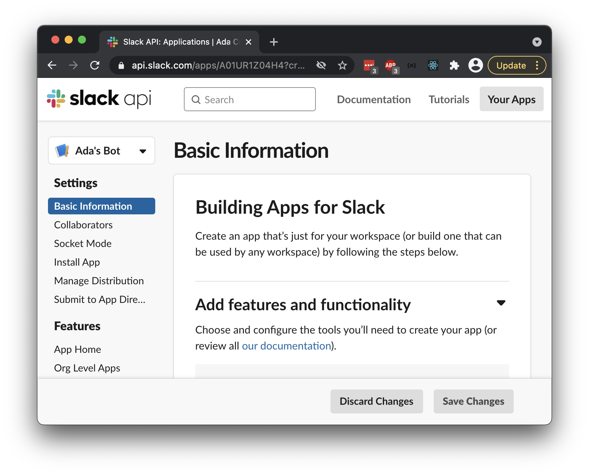

### Configure Your Slackbot, and Get Your Slackbot API Key (Token)

After seeing the header "Add features and functionality" and expanding it, click "Permissions."

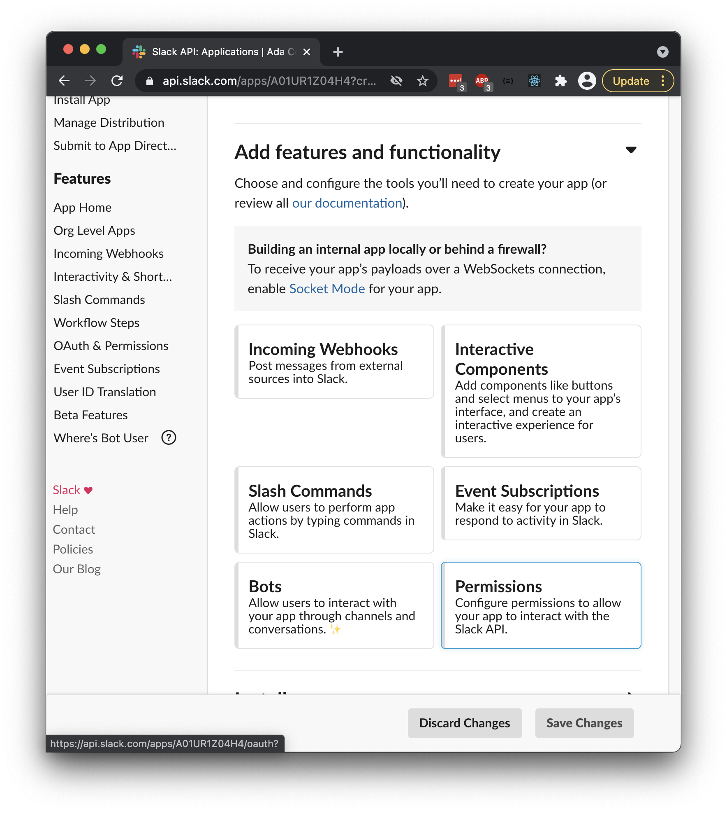

Scroll down to "Scopes" and "Bot Token Scopes"

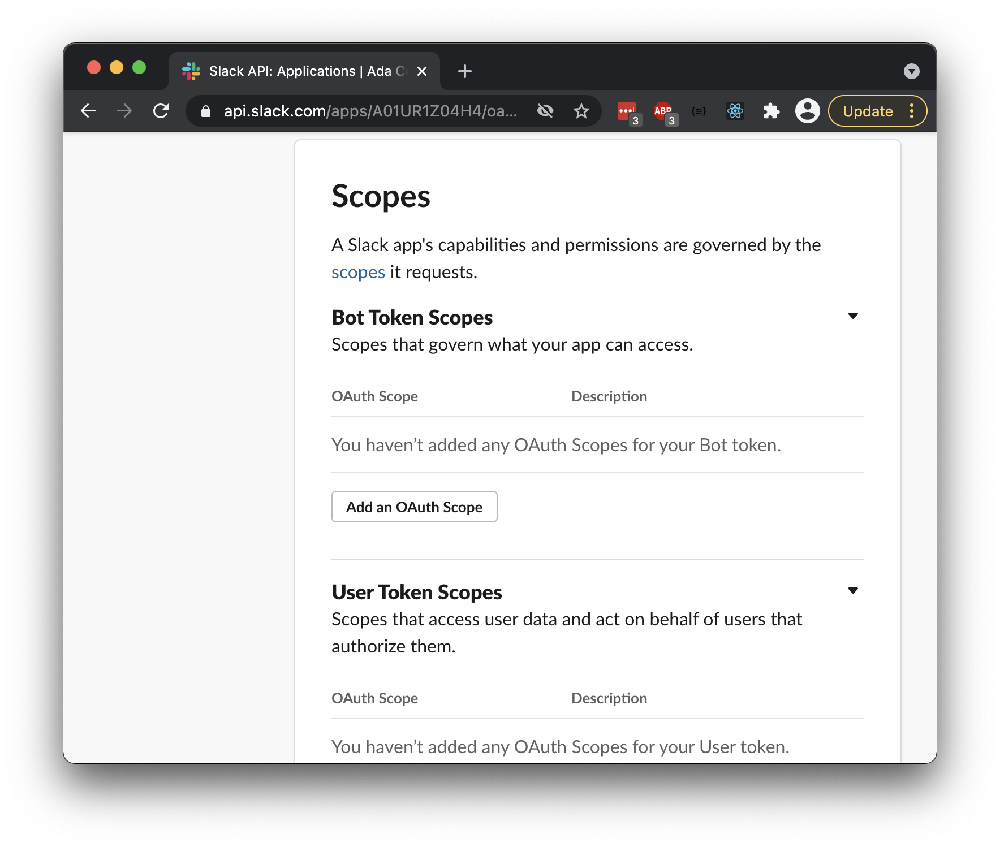

Add `chat:write` and `chat:write.public` to "Bot Token Scopes"

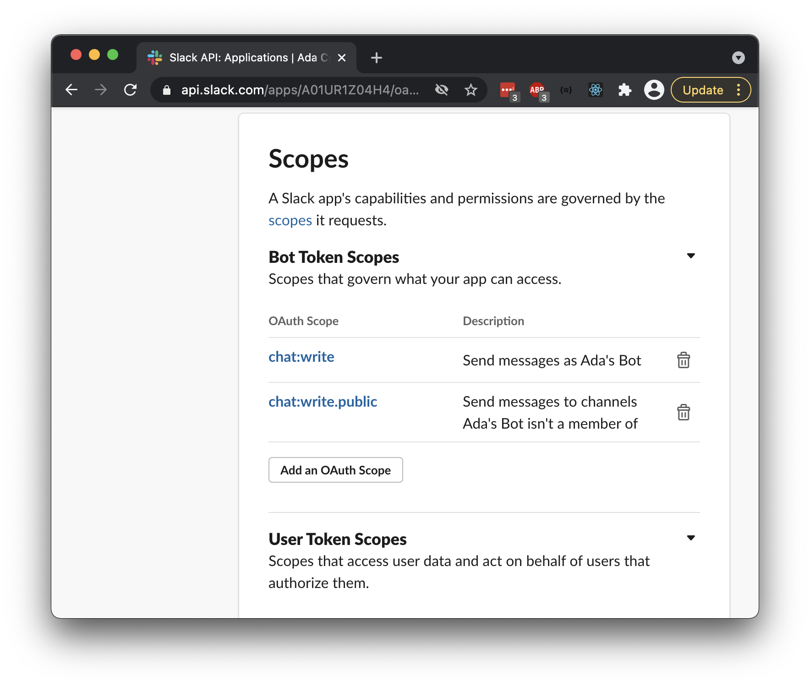

Scroll up, and click the button named "Install to Workspace."

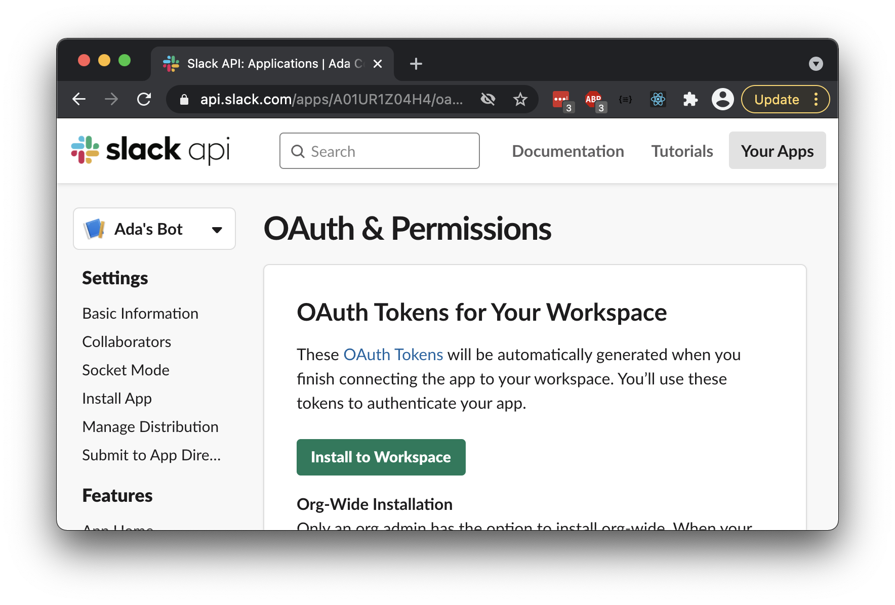

This brings you to an authorization page. Accept and authorize your Slackbot.

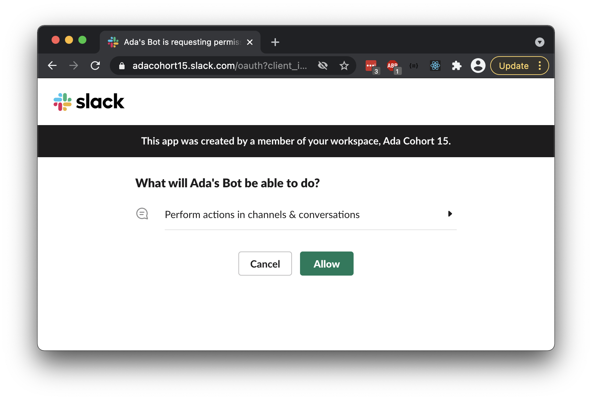

At the top, find the section "OAuth Tokens for Your Workspace"

- Find the value titled "Bot User OAuth Access Token"
- This value should always start with the characters `xoxb`
- This value is your bot token. **Be ready to copy/paste and keep this value**.

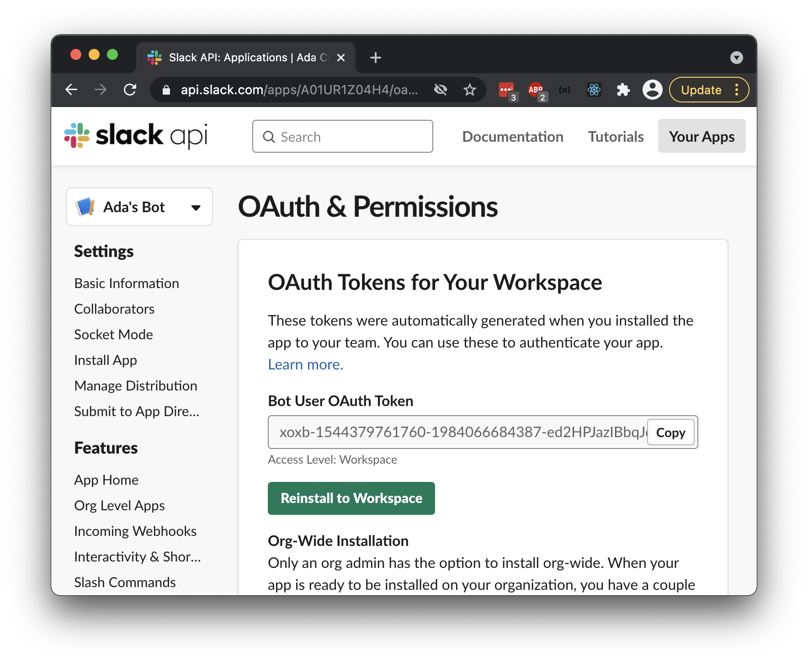

Whenever you want to go back to this page, follow these steps:

1. Go to "Your apps" using the top right button
1. Click your app
1. Expand the "Features and functionality" section
1. Go to "OAuth & Permissions"

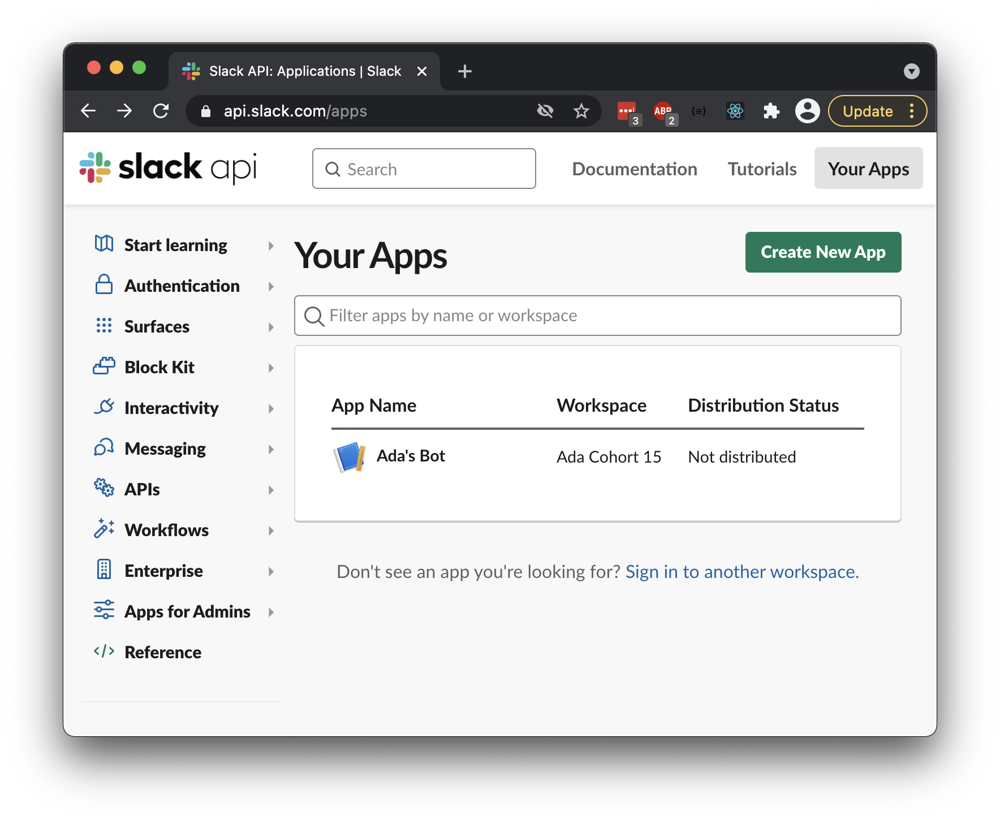

### Verify the API Key with the Slack Tester

We want to verify that our new Slackbot API key works with the Slack API functionality we need.

Visit https://api.slack.com/methods/chat.postMessage to read about the Slack API endpoint we will use in our project.

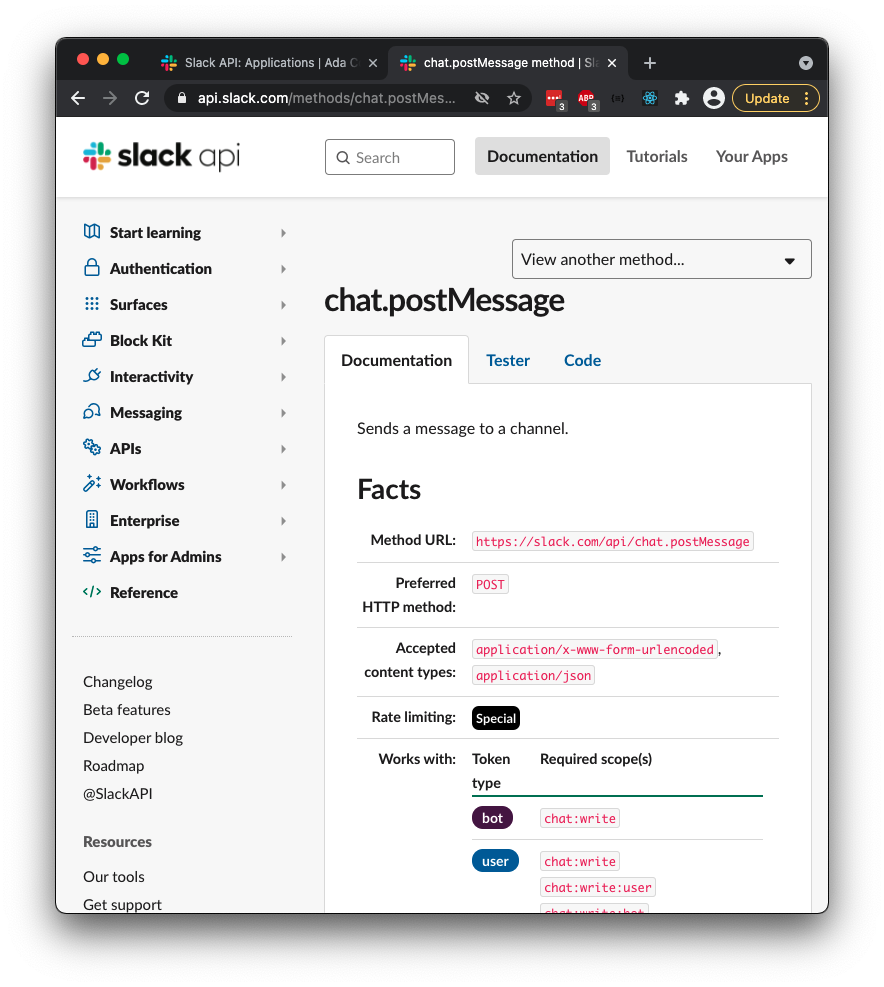

Answer the following questions. These questions will help you become familiar with the API, and make working with it easier.

- What is the responsibility of this endpoint?
- What is the URL and HTTP method for this endpoint?
- What are the _two_ _required_ arguments for this endpoint?
- How does this endpoint relate to the Slackbot API key (token) we just created?

Now, visit https://api.slack.com/methods/chat.postMessage/test.

Fill in the HTTP Request info to test this endpoint.

- For `token`, paste in the Slackbot token you created earlier
- For `channel`, type in `task-notifications` (or the name of a public, existing channel in your Slack workspace)
- For `text`, type in a nice message for everyone to read, such as "Hello, World!"

Press the "Test Method" button!

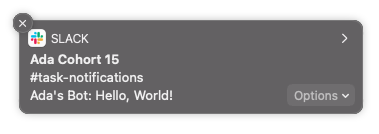

Scroll down to see the HTTP response. Answer the following questions:

- Did we get a success message? If so, did we see the message in our actual Slack workspace?
- Did we get an error emssage? If so, why?
- What is the shape of this JSON? Is it a JSON object or array? What keys and values are there?

### Verify with Postman

Let's verify that this API call works even in Postman!

Open Postman and make a request that mimics the API call to Slack that we just tested.

- Change the method to `POST`
- Use this as the request URL: `https://slack.com/api/chat.postMessage`
- In "Params," fill in the following values:
  - `channel`: `task-notifications`
  - `text`: Fill in a nice message

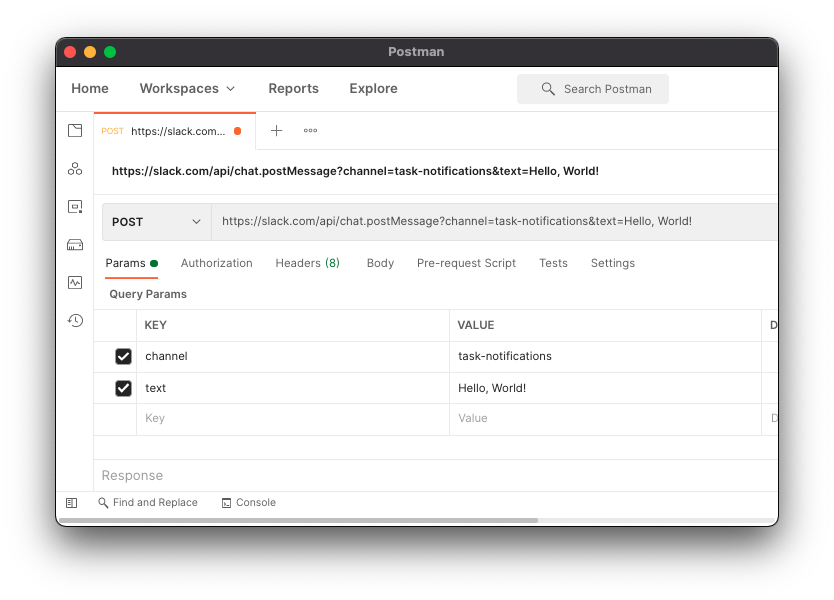

- In "Headers," add this new key-value pair:
  - `Authorization`: `"Bearer xoxb-150..."`, where `xoxb-150...` is your full Slackbot token

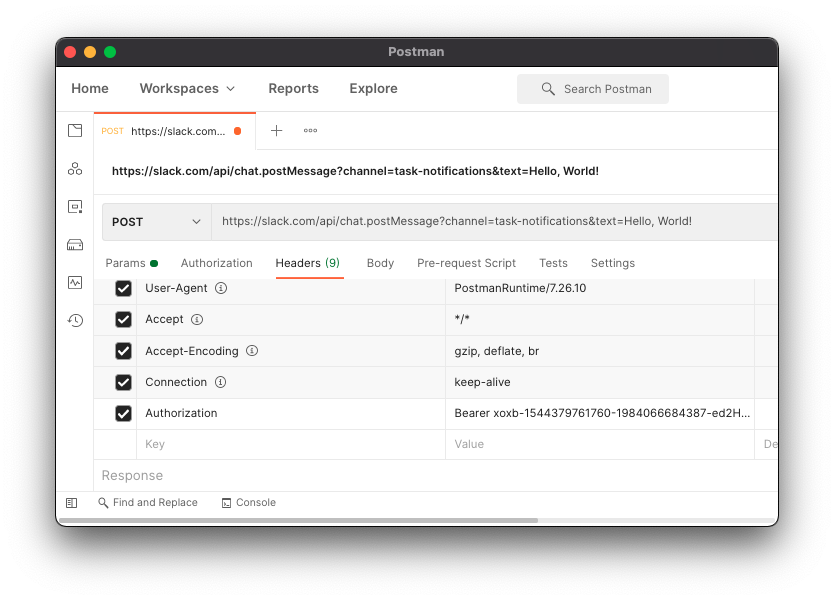

Press "Send" and see the Slack message come through!

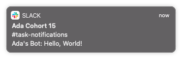

#### Tips

- We could put in the token as a query param. However, the Slack API documentation states that it prefers API keys to be sent in the "Authorization" request header.

### Modify `/tasks/<task_id>/mark_complete` to Call the Slack API

Now that we've verified that we can successfully make a request to the Slack API, let's write some code to automatically call the Slack API from the API we've created!

Given a task that has:

- An id `1`
- A `title` attribute with the value `"My Beautiful Task"`
- A `completed_at` attribute with a `null` value

when I send a `PATCH` request to `/tasks/1/mark_complete`,

then a Slack message is immediately sent to the channel `task-notifications` in the configured Slack workspace, with the text `"Someone just completed the task My Beautiful Task"`. "My Beautiful Task" should be the title of the task.

### Requirement: Does Not Affect Other Functionality

This feature should not affect other features in other waves, nor should it affect toggling a task incomplete.

### Requirement: Intentional Slackbot Token Location

Our Slackbot token is an API key that needs to be protected.

Include your Slackbot token in your code in an intentional way, following best practices about API keys in code bases.

### Requirement: Use Python package `requests` to make HTTP calls

Remember to import this package

Consider using the keyword argument `data`, `json`, and/or `headers`

#### Tips
- Remember to put your Slackbot token in your code in an intentional way, following best practices about API keys in code bases.
- In order to get the value of an environment variable, use `os.environ.get()`, just as we used it for the database configuration.
- Use your work from the Slack API documentation, the Slack tester, and Postman to guide your implementation.

### Test and Verify with Postman

Test and verify that your API sends an API call to the Slack web API by using Postman!

Send `PATCH` requests to `localhost:5000/tasks/<book_id>/mark_complete` (use the ID of any existing task), and check if Slack messages were sent.

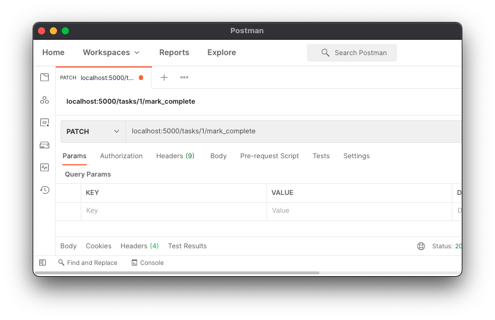

