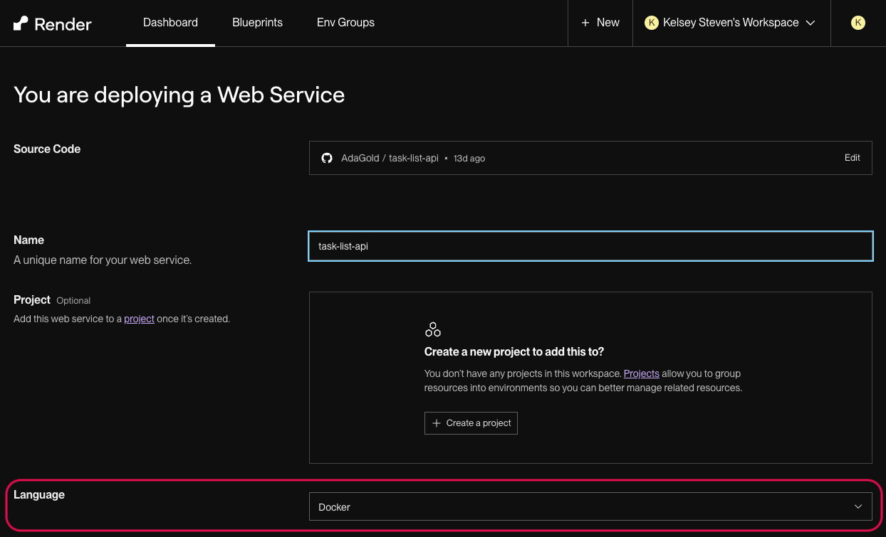

# Wave 7: Deployment

## Goal

Our goal is to make our project accessible online!

## Requirements

Deploy this project to Render.

When deploying a web service to Render, it will try to be helpful and set the `Language` field for you, but it doesn't always select the correct option.

Our language for this project should be `Python 3`, which you can select from a drop down if needed by clicking on the current value of the `Language` field.

Once deployed, add some Task records and Goal records to the production database.

Be sure to grab the URL of your deployed app. It will be submitted at the time of project submission.

### Tips

- When unexpected issues come up, employ all of your debugging skills:
    - Write down what step/command just created the issue
    - Write down how you observe the issue
    - Attempt to recreate the issue locally
    - Use Postman, the browser, and the debugger tools
    - Use the Render logs
    - Research error messages
    - Rubber duck and ask for help
